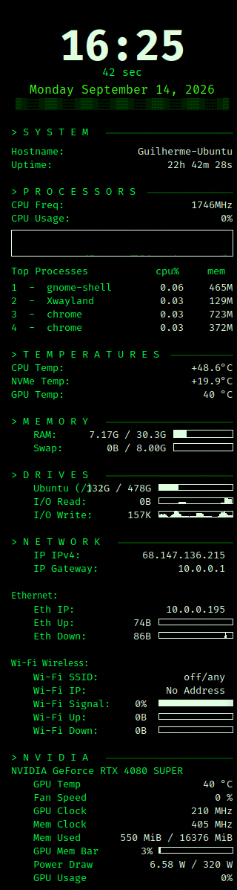
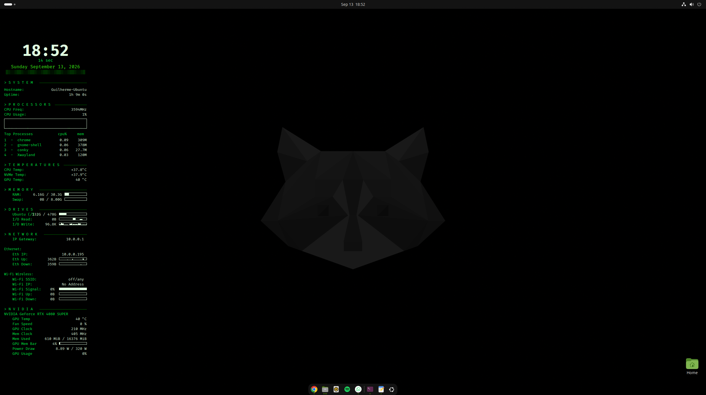

# Rizzo Matrix Conky

A [Conky](https://github.com/brndnmtthws/conky) theme inspired by the visual style of the movie **The Matrix**: transparent background, phosphorescent green, monospaced font, and a big digital clock front and center. Built on top of an already-optimized `.conkyrc` that monitors CPU, memory, temperatures, disks, network, and NVIDIA GPU.


## Preview

> Add a screenshot of your desktop with the conky running here:
>
> 
> 

## Features

- 🟢 Matrix-style color palette (`#00FF41` / `#39FF14` on a transparent black background)
- ⏰ Big digital-counter-style clock at the top, with date and seconds
- 🖥️ Overall CPU usage (not per-core) + frequency + graph
- 🧠 RAM and Swap on separate lines, with usage bars
- 🌡️ Dedicated temperatures section (CPU, NVMe/SSD, and GPU)
- 📊 Top 4 processes by CPU usage, with memory shown in MB/GB (right-aligned)
- 💾 Disk usage and read/write I/O (NVMe)
- 🌐 Network status for Ethernet (`enp5s0`) and Wi-Fi (`wlp6s0`), plus public IPv4 lookup
- 🎮 Full GPU metrics via `nvidia-smi` (temperature, clocks, VRAM, power draw, usage)
- ▓▒░ Separators and prefixes that evoke a terminal

## Requirements

| Component | Note |
|---|---|
| [Conky](https://github.com/brndnmtthws/conky) | tested on version 1.22.2 |
| **Fira Code** font | used throughout the theme |
| `lm-sensors` | for CPU/NVMe temperatures (`sensors` command) |
| NVIDIA driver + `nvidia-smi` | for the GPU section |
| `curl` | for the public IPv4 lookup (usually preinstalled) |
| `x11-xserver-utils` | optional, used for systemd autostart (`xset` command) |

## Installation

### 1. Install the Fira Code font

```bash
sudo apt update
sudo apt install fonts-firacode
fc-cache -fv
```

Confirm it was picked up:

```bash
fc-list | grep -i "fira code"
```

### 2. Install dependencies

```bash
sudo apt install conky-all lm-sensors x11-xserver-utils curl
sudo sensors-detect   # answer "yes" to the default prompts
```

### 3. Copy the config file

```bash
mkdir -p ~/.config/conky
cp Rizzo.conkyrc ~/.config/conky/Rizzo.conkyrc
```

### 4. Test it

```bash
conky -c ~/.config/conky/Rizzo.conkyrc
```

## Autostart (systemd user service)

Ubuntu 26.04 no longer ships the "Startup Applications" GUI, so autostart is handled through a **systemd user service**. Key points discovered during testing:

- `background = false` in the `.conkyrc` — required so systemd can track the process correctly (`background = true` makes Conky daemonize and "disappear" from systemd's view)
- A display-readiness check with `xset q`, followed by a `sleep 10`, to give XWayland, drivers, and the compositor time to stabilize before Conky starts drawing

Example unit (`~/.config/systemd/user/conky.service`):

```ini
[Unit]
Description=Conky Matrix Theme
After=graphical-session.target

[Service]
Type=simple
ExecStartPre=/bin/sh -c 'until xset q; do sleep 1; done; sleep 10'
ExecStart=/usr/bin/conky -c %h/.config/conky/Rizzo.conkyrc
Restart=on-failure

[Install]
WantedBy=graphical-session.target
```

Enable it:

```bash
systemctl --user daemon-reload
systemctl --user enable --now conky.service
```

## Customization

### Colors (Matrix theme)

| Variable | Color | Used for |
|---|---|---|
| `default_color` / `color2` / `color5` | `#00FF41` | default text, labels, section headers |
| `color1` | `#008F11` | graph outline/fill |
| `color3` | `#003B00` | dark background, separators |
| `color4` | `#39FF14` | highlights (date) |
| `color6` | `#E0FFE0` | clock, process names |
| `color7` / `color8` / `color9` | green / orange / red | status signaling (ok / warning / alert) |

### Common tweaks

- **NVMe temperature**: the `NVMe Temp` line depends on the label returned by `sensors` on your system. Run `sensors` in a terminal and adjust the `grep` (e.g. `nvme-pci-0400`) if the line doesn't show up.
- **Network interfaces**: replace `enp5s0` and `wlp6s0` with your own interface names (`ip a` to check).
- **Public IPv4**: fetched hourly (`execi 3600`) via `curl -4 -s https://ifconfig.me`. This makes an outbound request on every refresh — remove the line if you'd rather not expose that, or increase the interval to query less often.
- **Monitored drives**: the file includes commented-out blocks for extra drives — just uncomment and adjust the mount point.
- **Window size/position**: `minimum_width`, `maximum_width`, `gap_x`, `gap_y`, and `alignment` in the `conky.config` block.

## Credits

Based on the original ArcoLinux theme (Erik Dubois), with the "Titus" modifications and the "Rizzo" customizations (Matrix theme) described in the header of the `Rizzo.conkyrc` file itself.

## License

Distributed under the terms of the GNU GPL v2 or later, as in the original file.
